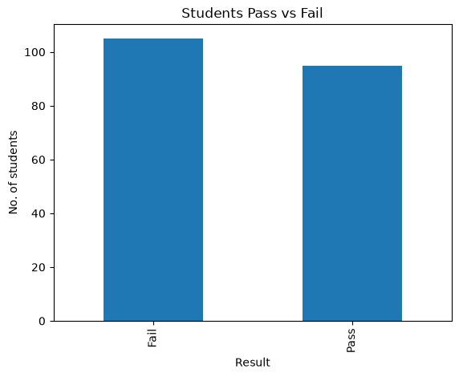
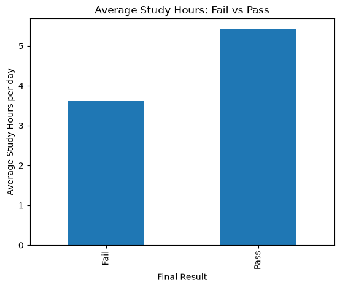
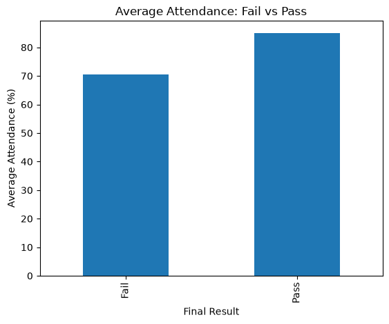
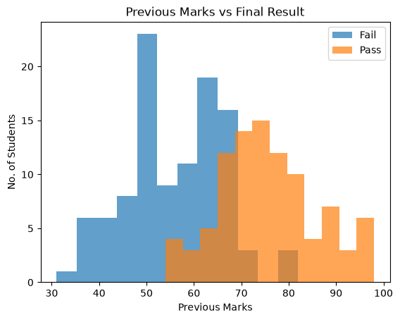
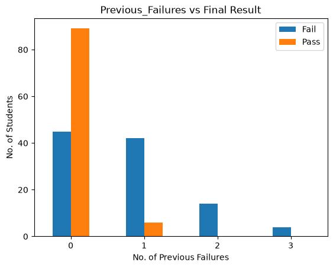

# Student Performance Prediction & Academic Analysis System

## 1. Problem Statement
An educational institute wants to identify students who are **at risk of failing**, so that teachers can give them extra academic support *before* the final exam. The institute holds information such as study hours, attendance, previous marks, assignment scores, internal marks and number of previous failures.

## 2. Objective
Build a simple Machine Learning system that **predicts whether a student will Pass or Fail** and gives a basic recommendation based on that prediction.

## 3. Dataset Description
`Student_Performance.csv` - **synthetic** dataset (generated with `claude`), 200 students after cleaning (202 raw rows).

| Column | Description |
|---|---|
| Student_ID | Unique student ID (not used for prediction) |
| Study_Hours | Average daily study hours |
| Attendance | Attendance percentage |
| Previous_Marks | Previous examination marks |
| Assignment_Score | Assignment marks |
| Internal_Marks | Internal examination marks |
| Previous_Failures | Number of previous failures |
| Final_Result | **Target** - Pass / Fail |

The raw file intentionally contains 5 missing values and 2 duplicate rows to practise data cleaning.

## 4. Technologies Used
Python, Jupyter Notebook, Pandas, NumPy, Matplotlib, Scikit-learn, Joblib, CSV.

## 5. Project Workflow
```
Dataset -> Data Understanding -> Data Cleaning -> Data Analysis -> Visualization -> Feature Selection -> Train/Test Split -> ML Model -> Prediction -> Evaluation -> Final Insights
```

## 6. Data Cleaning
- Found **5 missing values** (3 in Attendance, 2 in Assignment_Score) -> filled with the **median** of the column.
- Found **2 duplicate rows** -> removed with `drop_duplicates()`.
- Result: 200 clean student records, 0 missing, 0 duplicates.

## 7. Data Analysis (key findings)
| Feature | Fail (avg) | Pass (avg) |
|---|---|---|
| Study hours / day | 3.6 | 5.4 |
| Attendance (%) | 70.4 | 85.0 |
| Previous marks | 55.8 | 75.6 |
| Previous failures | 0.78 | 0.06 |

Most strongly related to the result: **Previous_Marks** (correlation 0.70). `Previous_Failures` is negatively related (-0.50).

## 8. ML Model
- **Logistic Regression** (main model) - features: 6 input columns, target: Final_Result (Pass=1, Fail=0).
- 80% training (160 students) / 20% testing (40 students), `random_state=42`.
- Optional: **Decision Tree** for comparison.

## 9. Accuracy / Results
| Model | Test Accuracy |
|---|---|
| Logistic Regression | **92.5%** |
| Decision Tree | 87.5% |

Confusion matrix (Logistic Regression): 19 correct Fail, 18 correct Pass, 0 false Pass, 3 false Fail.  
Accuracy will vary slightly if you regenerate the dataset.

## 10. Screenshots










## 11. How to Run
```bash
pip install -r requirements.txt
python generate_dataset.py                      # (optional) re-create the CSV
jupyter notebook Student_Performance_Analysis.ipynb   # run all cells
python predict_student.py                       # try the saved model
```

## 12. Project Structure
```
Student_Performance_ML/
├── .gitignore
├── app.py
├── Student_Performance.csv
├── Student_Performance_Analysis.ipynb
├── README.md
├── requirements.txt
├── student_pass_fail_model.pkl
└── screenshots/ 
```

## 13. Conclusion
Attendance, study hours, previous marks, internal marks and previous failures all clearly separate passing from failing students. A simple Logistic Regression model predicts Pass/Fail with about 92% accuracy on unseen students and can be turned into practical recommendations for teachers.

## 14. Future Scope
- Use **real** student data (anonymised) instead of synthetic data.
- Add more features (sleep, health, family support, participation).
- Try Random Forest / cross-validation and hyper-parameter tuning.
- Predict the actual marks (regression), not only Pass/Fail.
- Build a simple web app (Streamlit / Flask) for teachers.